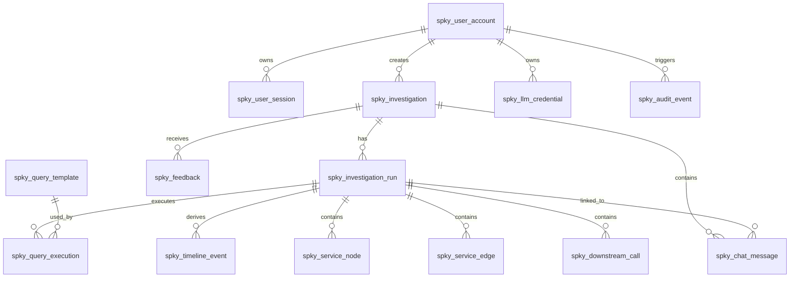

# Splunky Database Design

## 1. Purpose

This document defines the PostgreSQL 16 database design for **Splunky**.

Splunky stores durable investigation metadata, chat history, query execution metadata, derived evidence, and LLM credential records. It must **not** persist raw Splunk log payloads.

The backend stack is:

| Item | Choice |
|---|---|
| Backend | Java 17 + Spring Boot 3 |
| Package root | `com.wpb.spky` |
| Database | PostgreSQL 16 |
| Table prefix | `spky_` |
| Flyway history table | `spky_flyway_schema_history` |

---

## 2. Design Principles

### 2.1 Prefix all application tables with `spky_`

Every Splunky-owned table must use the `spky_` prefix.

Examples:

- `spky_user_account`
- `spky_investigation`
- `spky_investigation_run`
- `spky_chat_message`
- `spky_query_execution`

### 2.2 Prefix Flyway metadata table as well

Flyway should not use the default `flyway_schema_history` table name.

Use:

```yaml
spring:
  flyway:
    enabled: true
    table: spky_flyway_schema_history
    locations: classpath:db/migration
```

Flyway will create `spky_flyway_schema_history` automatically. Do **not** create it manually in migration SQL.

### 2.3 Do not store Splunk username/password

Users enter their Splunk username and password to start a Splunky session.

Splunky uses those credentials to call Splunk APIs on behalf of the current user, but the Splunk password must not be stored in PostgreSQL.

Allowed to store:

- session metadata;
- Splunk username for audit/reference;
- login time;
- session expiry;
- last activity timestamp.

Not allowed to store:

- Splunk password;
- Splunk auth token if it can be used as a reusable credential, unless encrypted and required by a future design;
- raw Splunk logs.

### 2.4 Do not store raw Splunk logs

Splunky may store structured and derived evidence, for example:

- timeline events;
- service graph nodes and edges;
- downstream call summaries;
- query metadata;
- generated AI summary;
- Splunk deep links.

Splunky should not persist full raw Splunk result payloads.

The UI may temporarily receive raw log previews from the active query response, but those previews are not durable database records.

### 2.5 Hybrid normalized + JSONB model

The MVP should use a hybrid model:

- normalized tables for key UI views and queryable fields;
- JSONB for flexible derived payloads and future UI extensions.

This avoids over-normalizing too early while still supporting practical filtering and history.

---

## 3. Logical Data Model



---

## 4. Table Overview

| Table | Purpose | Stores Raw Splunk Logs? |
|---|---|---:|
| `spky_user_account` | Local user profile keyed by username | No |
| `spky_user_session` | Session metadata only; no Splunk password | No |
| `spky_llm_credential` | Encrypted user LLM credential/API key | No |
| `spky_investigation` | Investigation container | No |
| `spky_investigation_run` | One execution/re-execution of an investigation | No |
| `spky_chat_message` | User/assistant chat history | No |
| `spky_query_template` | Approved Splunk query templates | No |
| `spky_query_execution` | Executed SPL metadata and Splunk link | No |
| `spky_timeline_event` | Derived request timeline events | No |
| `spky_service_node` | Derived service graph nodes | No |
| `spky_service_edge` | Derived service graph edges | No |
| `spky_downstream_call` | Derived downstream call table | No |
| `spky_feedback` | User feedback on result/run/message | No |
| `spky_audit_event` | Audit events | No |
| `spky_flyway_schema_history` | Flyway migration history | No |

---

## 5. Core Table Design

## 5.1 `spky_user_account`

Stores a lightweight local profile. The username usually maps to the Splunk username used for session login.

No password is stored.

| Column | Type | Notes |
|---|---|---|
| `user_id` | UUID | PK, generated by application |
| `username` | VARCHAR(128) | Unique user identifier |
| `display_name` | VARCHAR(256) | Optional |
| `email` | VARCHAR(256) | Optional |
| `status` | VARCHAR(32) | `ACTIVE`, `DISABLED` |
| `last_login_at` | TIMESTAMPTZ | Last Splunky session login |
| `created_at` | TIMESTAMPTZ | Default now |
| `updated_at` | TIMESTAMPTZ | Default now |

---

## 5.2 `spky_user_session`

Stores session metadata. It must not store the Splunk password.

The actual Splunk credential is held only in the backend session/runtime credential manager.

| Column | Type | Notes |
|---|---|---|
| `session_id` | UUID | PK |
| `user_id` | UUID | FK to `spky_user_account` |
| `splunk_username` | VARCHAR(128) | For reference/audit only |
| `environment` | VARCHAR(64) | Example: `SIT`, `UAT`, `NFT` |
| `status` | VARCHAR(32) | `ACTIVE`, `EXPIRED`, `LOGGED_OUT` |
| `started_at` | TIMESTAMPTZ | Session start |
| `expires_at` | TIMESTAMPTZ | Session expiry |
| `last_activity_at` | TIMESTAMPTZ | Last request time |
| `ended_at` | TIMESTAMPTZ | Logout/expiry time |
| `created_at` | TIMESTAMPTZ | Default now |

---

## 5.3 `spky_llm_credential`

Stores the user-level LLM credential for the Copilot-backed MVP provider.

The actual API key/token must be encrypted before storage.

| Column | Type | Notes |
|---|---|---|
| `credential_id` | UUID | PK |
| `user_id` | UUID | FK to `spky_user_account` |
| `provider` | VARCHAR(64) | Example: `COPILOT_PERSONAL` |
| `credential_type` | VARCHAR(64) | Example: `API_KEY`, `ACCESS_TOKEN` |
| `encrypted_secret` | TEXT | Encrypted API key/token |
| `secret_fingerprint` | VARCHAR(128) | Non-sensitive hash/fingerprint for diagnostics |
| `expires_at` | TIMESTAMPTZ | Current credential expiry |
| `last_refreshed_at` | TIMESTAMPTZ | Last refresh time |
| `status` | VARCHAR(32) | `ACTIVE`, `EXPIRED`, `REVOKED` |
| `created_at` | TIMESTAMPTZ | Default now |
| `updated_at` | TIMESTAMPTZ | Default now |

Implementation detail, such as the 30-minute refresh behavior, belongs in backend implementation/configuration rather than the solution design. The DB model only needs to support expiry and refresh metadata.

---

## 5.4 `spky_investigation`

Top-level container for an investigation session.

One investigation can have multiple runs, but only one active run is shown in the main UI.

| Column | Type | Notes |
|---|---|---|
| `investigation_id` | UUID | PK |
| `user_id` | UUID | FK to `spky_user_account` |
| `session_id` | UUID | Optional FK to `spky_user_session` |
| `title` | VARCHAR(512) | UI title, generated from input |
| `environment` | VARCHAR(64) | `SIT`, `UAT`, etc. |
| `initial_input_type` | VARCHAR(64) | `CORRELATION_ID`, `ERROR_RESPONSE`, `API_NAME`, `NATURAL_LANGUAGE`, `UNKNOWN` |
| `initial_input_text` | TEXT | User initial input; may contain pasted error response |
| `active_run_id` | UUID | Current active run |
| `status` | VARCHAR(32) | `RUNNING`, `COMPLETED`, `FAILED`, `ARCHIVED` |
| `created_at` | TIMESTAMPTZ | Default now |
| `updated_at` | TIMESTAMPTZ | Default now |

---

## 5.5 `spky_investigation_run`

Represents one execution of an investigation.

Examples:

- initial investigation;
- follow-up that triggers re-query;
- expanded time window;
- changed API name;
- changed downstream filter.

| Column | Type | Notes |
|---|---|---|
| `run_id` | UUID | PK |
| `investigation_id` | UUID | FK to `spky_investigation` |
| `run_no` | INTEGER | Sequential number within investigation |
| `trigger_type` | VARCHAR(64) | `INITIAL`, `FOLLOW_UP_RERUN`, `MANUAL_RERUN` |
| `user_prompt` | TEXT | Prompt that triggered this run |
| `intent` | VARCHAR(128) | Detected intent |
| `detected_entities_json` | JSONB | Extracted correlation ID/API/time range/etc. |
| `time_range_from` | TIMESTAMPTZ | Search start |
| `time_range_to` | TIMESTAMPTZ | Search end |
| `status` | VARCHAR(32) | `RUNNING`, `COMPLETED`, `FAILED`, `CANCELLED` |
| `final_status` | VARCHAR(64) | UI summary: `SUCCESS`, `FAILED`, `PARTIAL`, `UNKNOWN` |
| `failure_point` | VARCHAR(512) | Example: `payment-sapi -> hub-api` |
| `hypothesis` | TEXT | AI-generated short hypothesis |
| `confidence` | VARCHAR(32) | `HIGH`, `MEDIUM`, `LOW`, `UNKNOWN` |
| `summary_json` | JSONB | Derived summary card payload |
| `result_payload_json` | JSONB | UI-friendly derived result excluding raw logs |
| `error_message` | TEXT | Failure details if run failed |
| `created_at` | TIMESTAMPTZ | Default now |
| `completed_at` | TIMESTAMPTZ | Nullable |

`result_payload_json` must not include raw Splunk event payloads. It can include IDs, counts, statuses, service names, timestamps, derived messages, and Splunk links.

---

## 5.6 `spky_chat_message`

Stores the conversation around an investigation.

| Column | Type | Notes |
|---|---|---|
| `message_id` | UUID | PK |
| `investigation_id` | UUID | FK to `spky_investigation` |
| `run_id` | UUID | Optional FK to `spky_investigation_run` |
| `role` | VARCHAR(32) | `USER`, `ASSISTANT`, `SYSTEM` |
| `message_type` | VARCHAR(64) | `QUESTION`, `ANSWER`, `RERUN_NOTICE`, `ERROR` |
| `content` | TEXT | Message text |
| `action` | VARCHAR(64) | `ANSWER_FROM_CURRENT_RESULT`, `REFINE_ANALYSIS`, `RERUN_QUERY`, `NEW_INVESTIGATION` |
| `metadata_json` | JSONB | Optional UI metadata |
| `created_at` | TIMESTAMPTZ | Default now |

---

## 5.7 `spky_query_template`

Stores approved query templates.

This enables template-guided Splunk querying instead of unconstrained free-form SPL generation.

| Column | Type | Notes |
|---|---|---|
| `template_id` | UUID | PK |
| `template_key` | VARCHAR(128) | Unique key, e.g. `FIND_BY_CORRELATION_ID` |
| `name` | VARCHAR(256) | Human-readable name |
| `description` | TEXT | Template description |
| `template_spl` | TEXT | Parameterized SPL template |
| `allowed_indexes_json` | JSONB | Allowed Splunk indexes |
| `required_params_json` | JSONB | Required parameters |
| `optional_params_json` | JSONB | Optional parameters |
| `default_time_window_minutes` | INTEGER | Default search window |
| `max_time_window_minutes` | INTEGER | Guardrail |
| `max_result_count` | INTEGER | Guardrail |
| `enabled` | BOOLEAN | Template enabled flag |
| `created_at` | TIMESTAMPTZ | Default now |
| `updated_at` | TIMESTAMPTZ | Default now |

---

## 5.8 `spky_query_execution`

Stores metadata about executed Splunk queries.

This table does not store raw result payloads.

| Column | Type | Notes |
|---|---|---|
| `query_id` | UUID | PK |
| `run_id` | UUID | FK to `spky_investigation_run` |
| `template_id` | UUID | Optional FK to `spky_query_template` |
| `template_key` | VARCHAR(128) | Denormalized key for easier display |
| `query_label` | VARCHAR(256) | Example: `Find by correlation ID` |
| `spl_text` | TEXT | Executed SPL text |
| `spl_hash` | VARCHAR(128) | Hash for dedupe/audit |
| `earliest_time` | TIMESTAMPTZ | Query earliest time |
| `latest_time` | TIMESTAMPTZ | Query latest time |
| `splunk_search_id` | VARCHAR(256) | Splunk search job ID if available |
| `splunk_deeplink` | TEXT | Open-in-Splunk URL |
| `status` | VARCHAR(32) | `RUNNING`, `COMPLETED`, `FAILED`, `TIMEOUT` |
| `result_count` | INTEGER | Number of returned events/results |
| `execution_time_ms` | INTEGER | Execution time |
| `error_message` | TEXT | Error if failed |
| `created_at` | TIMESTAMPTZ | Default now |
| `completed_at` | TIMESTAMPTZ | Nullable |

---

## 5.9 `spky_timeline_event`

Stores derived timeline events for the active/result run.

| Column | Type | Notes |
|---|---|---|
| `event_id` | UUID | PK |
| `run_id` | UUID | FK to `spky_investigation_run` |
| `event_order` | INTEGER | UI ordering |
| `event_time` | TIMESTAMPTZ | Event timestamp |
| `service_name` | VARCHAR(256) | Service that produced/owns the event |
| `event_type` | VARCHAR(128) | `INBOUND_REQUEST`, `VALIDATION`, `DOWNSTREAM_CALL`, `DOWNSTREAM_RESPONSE`, `ERROR`, etc. |
| `status` | VARCHAR(64) | `SUCCESS`, `FAILED`, `TIMEOUT`, `UNKNOWN` |
| `duration_ms` | INTEGER | Optional duration |
| `message` | TEXT | Derived message, not full raw log |
| `evidence_refs_json` | JSONB | References to query IDs, event offsets, Splunk links |
| `metadata_json` | JSONB | Flexible UI metadata |
| `created_at` | TIMESTAMPTZ | Default now |

---

## 5.10 `spky_service_node`

Stores derived service graph nodes.

| Column | Type | Notes |
|---|---|---|
| `node_id` | UUID | PK |
| `run_id` | UUID | FK to `spky_investigation_run` |
| `service_name` | VARCHAR(256) | Node label |
| `service_type` | VARCHAR(64) | `API`, `GATEWAY`, `DOWNSTREAM`, `UNKNOWN` |
| `platform` | VARCHAR(64) | `SHP`, `PCF`, `MULE`, `GATEWAY`, etc. |
| `status` | VARCHAR(64) | `SUCCESS`, `FAILED`, `PARTIAL`, `UNKNOWN` |
| `log_count` | INTEGER | Derived count |
| `error_count` | INTEGER | Derived error count |
| `first_seen_at` | TIMESTAMPTZ | First event time |
| `last_seen_at` | TIMESTAMPTZ | Last event time |
| `metadata_json` | JSONB | Flexible UI metadata |
| `created_at` | TIMESTAMPTZ | Default now |

---

## 5.11 `spky_service_edge`

Stores derived service graph edges.

| Column | Type | Notes |
|---|---|---|
| `edge_id` | UUID | PK |
| `run_id` | UUID | FK to `spky_investigation_run` |
| `caller_service` | VARCHAR(256) | Caller node |
| `callee_service` | VARCHAR(256) | Callee node |
| `operation` | VARCHAR(512) | Operation/endpoint if known |
| `status` | VARCHAR(64) | `SUCCESS`, `FAILED`, `TIMEOUT`, `UNKNOWN` |
| `latency_ms` | INTEGER | Optional latency |
| `call_count` | INTEGER | Number of calls |
| `confidence` | VARCHAR(32) | `CONFIRMED`, `INFERRED`, `UNKNOWN` |
| `evidence_refs_json` | JSONB | Query/log references, not raw logs |
| `metadata_json` | JSONB | Flexible UI metadata |
| `created_at` | TIMESTAMPTZ | Default now |

---

## 5.12 `spky_downstream_call`

Stores derived downstream call summaries.

| Column | Type | Notes |
|---|---|---|
| `call_id` | UUID | PK |
| `run_id` | UUID | FK to `spky_investigation_run` |
| `call_order` | INTEGER | UI order |
| `caller_service` | VARCHAR(256) | Caller |
| `downstream_service` | VARCHAR(256) | Downstream |
| `http_method` | VARCHAR(16) | Optional |
| `endpoint` | VARCHAR(1024) | Optional, avoid query string if sensitive |
| `operation` | VARCHAR(512) | Logical operation |
| `status` | VARCHAR(64) | `SUCCESS`, `FAILED`, `TIMEOUT`, `UNKNOWN` |
| `status_code` | INTEGER | HTTP status if known |
| `latency_ms` | INTEGER | Duration |
| `error_code` | VARCHAR(256) | Optional |
| `error_message` | TEXT | Derived/truncated message |
| `started_at` | TIMESTAMPTZ | Optional |
| `ended_at` | TIMESTAMPTZ | Optional |
| `evidence_refs_json` | JSONB | Query/log references, not raw logs |
| `metadata_json` | JSONB | Flexible UI metadata |
| `created_at` | TIMESTAMPTZ | Default now |

---

## 5.13 `spky_feedback`

Stores user feedback on an investigation, run, or assistant message.

| Column | Type | Notes |
|---|---|---|
| `feedback_id` | UUID | PK |
| `investigation_id` | UUID | FK to `spky_investigation` |
| `run_id` | UUID | Optional FK |
| `message_id` | UUID | Optional FK |
| `user_id` | UUID | FK |
| `rating` | VARCHAR(32) | `HELPFUL`, `NOT_HELPFUL` |
| `comment` | TEXT | Optional |
| `created_at` | TIMESTAMPTZ | Default now |

---

## 5.14 `spky_audit_event`

Stores audit records for important operations.

| Column | Type | Notes |
|---|---|---|
| `audit_id` | UUID | PK |
| `user_id` | UUID | Optional FK |
| `session_id` | UUID | Optional FK |
| `event_type` | VARCHAR(128) | Example: `SPLUNK_LOGIN`, `INVESTIGATION_CREATED`, `QUERY_EXECUTED` |
| `target_type` | VARCHAR(128) | Optional |
| `target_id` | UUID | Optional |
| `summary` | TEXT | Short audit text |
| `metadata_json` | JSONB | No raw logs or passwords |
| `created_at` | TIMESTAMPTZ | Default now |

---

## 6. Initial Flyway Migration

Recommended file:

```text
src/main/resources/db/migration/V1__init_spky_tables.sql
```

The companion SQL file generated with this design contains the initial table creation script:

- `spky_user_account`
- `spky_user_session`
- `spky_llm_credential`
- `spky_investigation`
- `spky_investigation_run`
- `spky_chat_message`
- `spky_query_template`
- `spky_query_execution`
- `spky_timeline_event`
- `spky_service_node`
- `spky_service_edge`
- `spky_downstream_call`
- `spky_feedback`
- `spky_audit_event`

Flyway will create `spky_flyway_schema_history` automatically because of this configuration:

```yaml
spring:
  flyway:
    table: spky_flyway_schema_history
```

---

## 7. Persistence Rules

### 7.1 Persist

Persist these:

- investigation metadata;
- active run ID;
- run summaries;
- query execution metadata;
- Splunk deep links;
- derived timeline events;
- derived service graph;
- derived downstream call summaries;
- user/assistant chat messages;
- user feedback;
- LLM credential metadata and encrypted secret;
- audit events.

### 7.2 Do not persist

Do not persist these:

- Splunk password;
- raw Splunk result payload;
- full raw log events;
- large unbounded log snapshots.

### 7.3 Allow transient memory/cache only

The backend may temporarily keep these in request/session memory:

- current Splunk credential;
- active Splunk API session token if needed;
- raw Splunk result events during normalization;
- raw log previews returned to UI immediately after a run.

They should not be stored in PostgreSQL.

---

## 8. Index Strategy

Recommended indexes:

| Table | Index |
|---|---|
| `spky_user_account` | unique index on `username` |
| `spky_user_session` | `user_id`, `status`, `expires_at` |
| `spky_llm_credential` | `user_id`, `provider`, `status` |
| `spky_investigation` | `user_id`, `environment`, `status`, `created_at` |
| `spky_investigation_run` | `investigation_id`, `run_no`, `status`, `created_at` |
| `spky_chat_message` | `investigation_id`, `run_id`, `created_at` |
| `spky_query_execution` | `run_id`, `template_key`, `status`, `created_at` |
| `spky_timeline_event` | `run_id`, `event_order`, `event_time` |
| `spky_service_node` | `run_id`, `service_name` |
| `spky_service_edge` | `run_id`, `caller_service`, `callee_service` |
| `spky_downstream_call` | `run_id`, `downstream_service`, `status` |
| `spky_feedback` | `investigation_id`, `run_id`, `created_at` |
| `spky_audit_event` | `user_id`, `session_id`, `event_type`, `created_at` |

---

## 9. Retention Recommendation

For test-environment MVP:

| Data | Suggested Retention |
|---|---:|
| Investigation metadata | 90 days |
| Chat messages | 90 days |
| Query execution metadata | 90 days |
| Derived timeline/graph/call summaries | 90 days |
| Audit events | 180 days |
| LLM credential | Until replaced/revoked |
| Raw Splunk logs | Not persisted |

Retention can be implemented later with scheduled cleanup jobs.

---

## 10. Notes for Backend Implementation

Recommended repository package mapping:

```text
com.wpb.spky
├── api
├── application
├── domain
├── persistence
│   ├── entity
│   └── repository
├── splunk
├── llm
├── security
└── audit
```

Recommended JPA naming approach:

- Use explicit `@Table(name = "spky_xxx")`.
- Use application-generated UUIDs.
- Avoid Postgres enum types for MVP; use `VARCHAR` + check constraints.
- Use JSONB columns via Hibernate JSON support or custom converter.
- Keep raw Splunk logs out of entity models.

