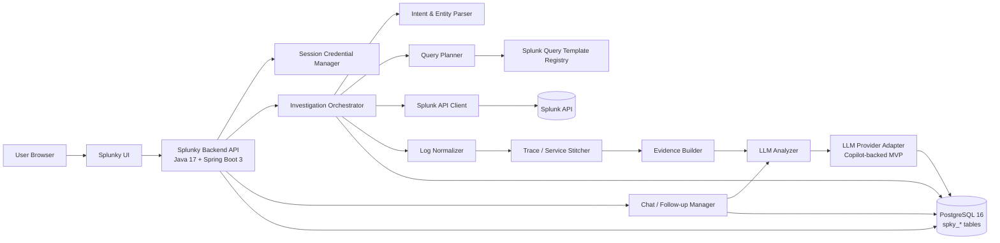
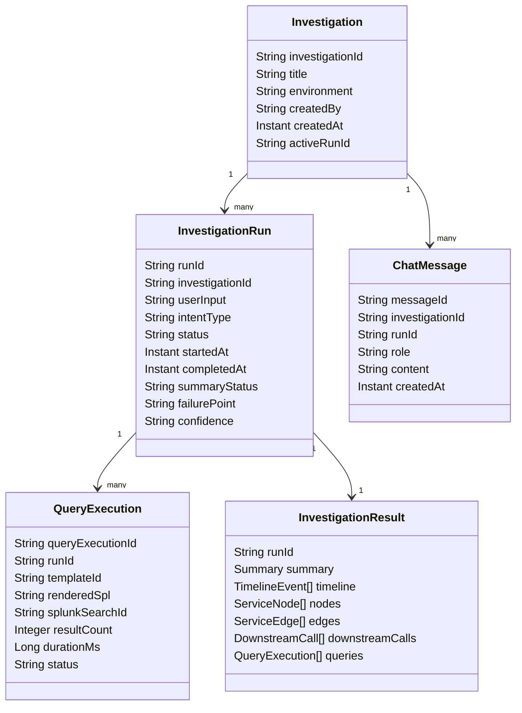
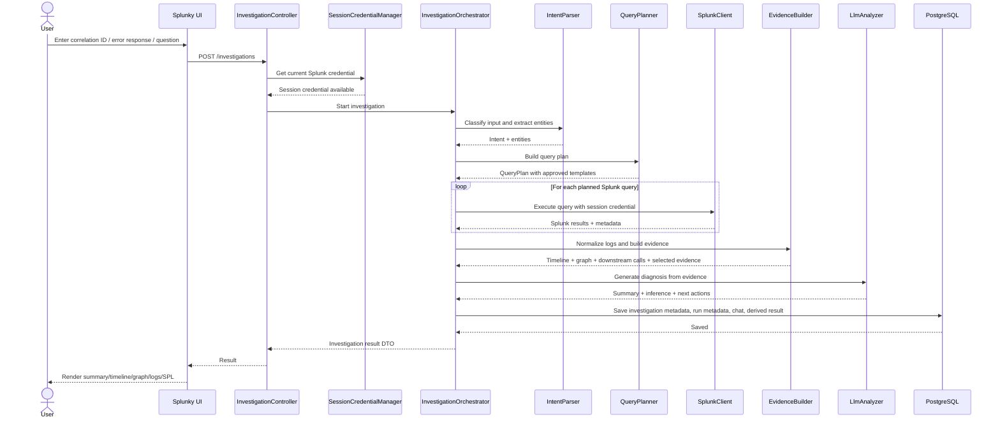
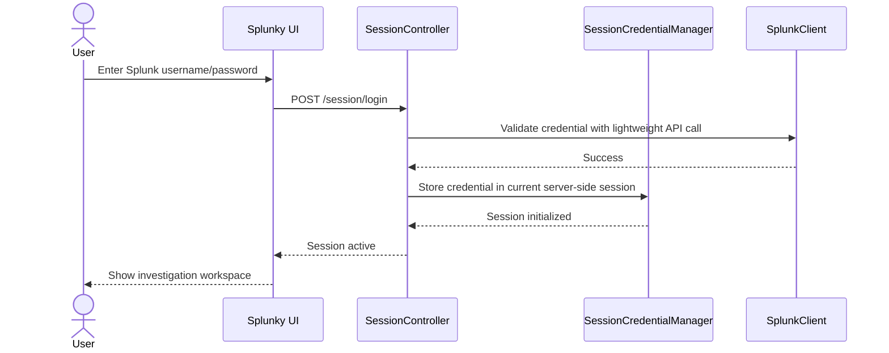
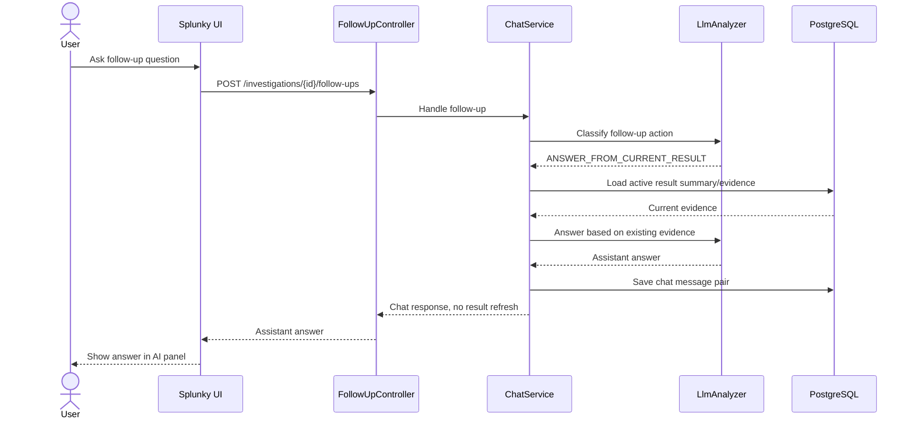
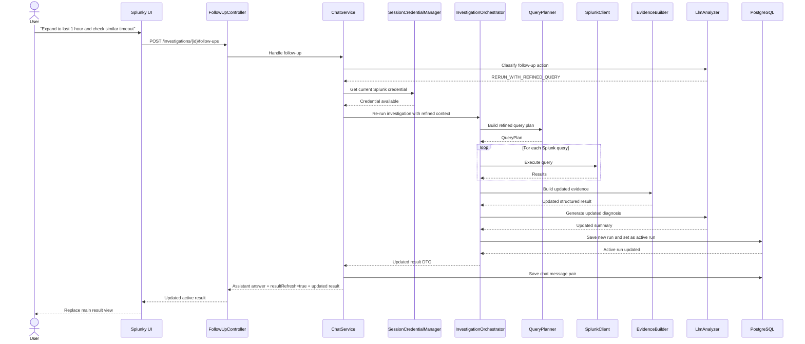
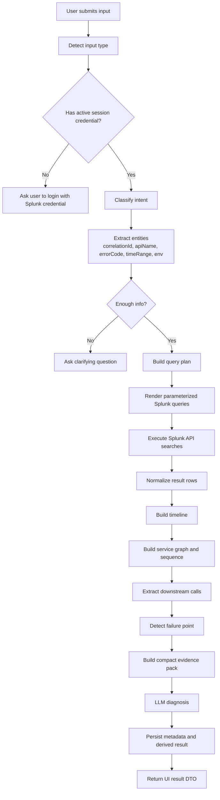
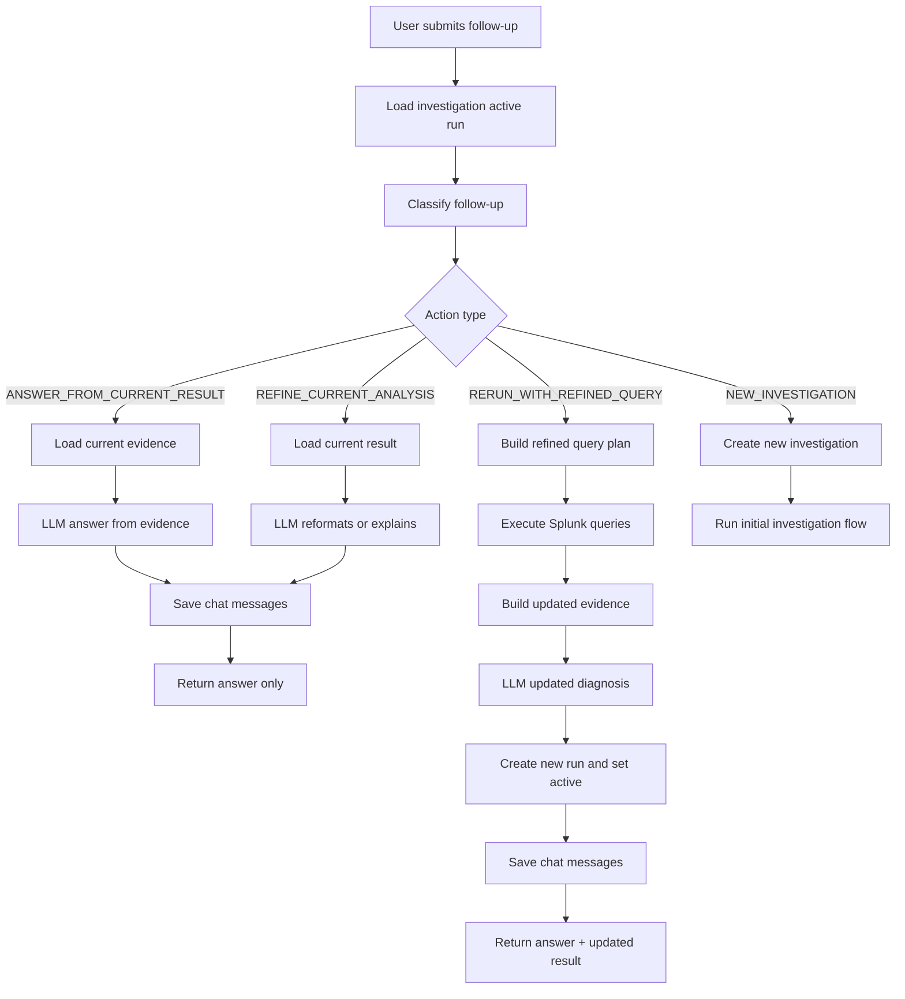
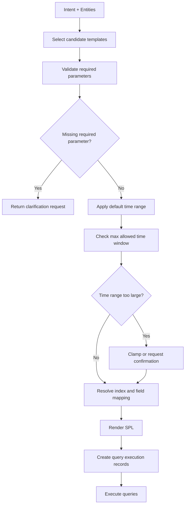
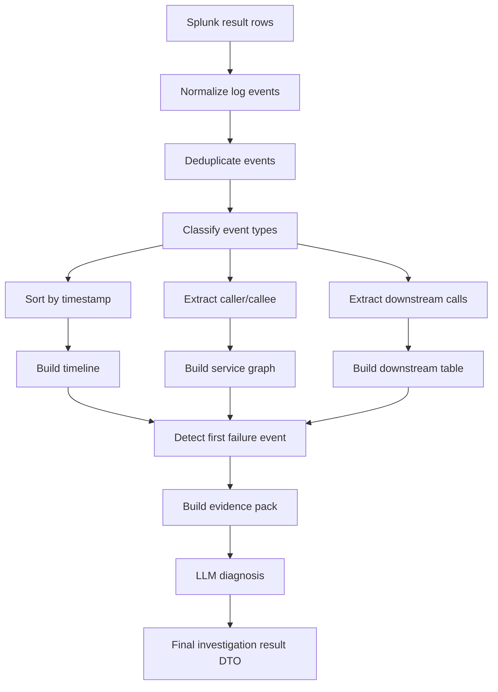

# Splunky Solution Design

## 1. Purpose

**Splunky** is an AI-assisted investigation tool for test-environment API troubleshooting.

Users can provide:

- a correlation ID
- an API name
- an error response
- a field value
- or a natural-language investigation request

Splunky will:

1. understand the user’s intent;
2. plan safe Splunk API searches;
3. execute those searches using the user’s own Splunk credential for the current session;
4. normalize and stitch returned logs into a request-level view;
5. ask the LLM to summarize the evidence;
6. present the result as structured views: summary, timeline, service graph, sequence view, downstream calls, raw log preview, and SPL/query inspector;
7. support follow-up questions, either by answering from existing evidence or by re-running Splunk queries and replacing the active result.

The initial scope is **test environment only**.

---

## 2. Design Principles

### 2.1 Evidence-first investigation

Splunky should not behave like a free-form chatbot only. The LLM must explain findings based on structured evidence retrieved from Splunk.

The UI should always show:

- what was searched;
- what evidence was found;
- which service/downstream failed;
- what is inferred versus directly observed;
- the raw/log evidence preview or Splunk link where possible.

### 2.2 User identity passthrough for Splunk

The user provides their Splunk username and password when starting a session.

Splunky uses those credentials to call Splunk APIs on behalf of that user.

Splunky does **not** persist Splunk usernames/passwords in the database.

### 2.3 No raw Splunk log persistence

Splunky may save investigation metadata, chat history, summaries, query metadata, and derived structured results.

Splunky should **not** persist raw Splunk logs, because the volume can become large and unnecessary for MVP.

### 2.4 Template-guided query planning

The LLM should not be allowed to execute arbitrary unbounded Splunk searches.

The recommended pattern is:

```text
User input
  -> intent classification
  -> entity extraction
  -> approved query template selection
  -> parameterized Splunk query generation
  -> Splunk API execution
```

### 2.5 Active-result model for follow-up

Splunky keeps one active result per investigation.

When a follow-up requires a new Splunk query, the latest run replaces the active result.

Historical runs can be stored as lightweight metadata, but the MVP does not need full result versioning.

---

## 3. Technology Stack

| Area | Choice |
|---|---|
| Backend language | Java 17 |
| Backend framework | Spring Boot 3 |
| Package root | `com.wpb.spky` |
| Database | PostgreSQL 16 |
| DB table prefix | `spky_` |
| Splunk integration | Splunk REST API |
| LLM provider | Copilot-backed personal subscription provider for MVP/test usage |
| Frontend | React-based pure frontend MVP, already covered in UI spec |
| Deployment target | Test environment first |

---

## 4. High-level Architecture



---

## 5. Main Runtime Responsibilities

### 5.1 Frontend

The frontend is responsible for rendering the investigation workspace.

Main UI areas:

- investigation input;
- result header/context bar;
- summary view;
- timeline view;
- service graph view;
- sequence view;
- downstream calls table;
- raw logs view;
- SPL/query inspector;
- right-side AI follow-up panel;
- lightweight run history.

The frontend should call backend APIs only. It should not call Splunk or the LLM provider directly.

---

### 5.2 Splunky Backend

The backend is the central orchestration layer.

Main responsibilities:

- maintain the user session;
- temporarily hold the current session’s Splunk credential;
- classify user investigation input;
- plan Splunk searches;
- call Splunk APIs;
- normalize Splunk results;
- build structured evidence;
- invoke the LLM for summarization and follow-up reasoning;
- persist chat history and investigation metadata;
- return UI-friendly result DTOs.

---

### 5.3 PostgreSQL

PostgreSQL stores durable product data.

Examples of data that can be stored:

- user LLM credential metadata;
- investigation records;
- run metadata;
- chat messages;
- query execution metadata;
- generated summaries;
- structured timeline/service graph/downstream call summaries;
- feedback;
- audit records.

PostgreSQL should not store raw Splunk logs.

The concrete DB design and DDL will be handled separately.

---

### 5.4 Splunk

Splunk remains the source of truth for logs.

Splunky uses Splunk APIs to:

- create searches;
- poll search results;
- retrieve event results;
- build Splunk deep links;
- fetch result counts and metadata.

Splunky should execute Splunk queries using the current user’s Splunk credential.

---

### 5.5 LLM Provider

For MVP/test usage, Splunky uses a Copilot-backed personal subscription provider.

The backend should abstract this behind an internal `LlmClient` interface, so future replacement with an internal LLM gateway does not impact the rest of the system.

The solution design should treat credential refresh and provider-specific mechanics as implementation detail.

---

## 6. Module Breakdown

Recommended Java package root:

```text
com.wpb.spky
```

Suggested package structure:

```text
com.wpb.spky
├── api
│   ├── controller
│   ├── dto
│   └── mapper
├── session
├── investigation
│   ├── orchestration
│   ├── intent
│   ├── planning
│   ├── evidence
│   ├── model
│   └── service
├── splunk
│   ├── client
│   ├── query
│   ├── template
│   ├── parser
│   └── model
├── llm
│   ├── client
│   ├── prompt
│   ├── provider
│   └── model
├── chat
├── history
├── config
├── security
├── audit
├── persistence
│   ├── entity
│   └── repository
└── common
    ├── exception
    ├── util
    └── constants
```

---

## 7. Module Responsibilities

### 7.1 `api.controller`

Provides REST APIs for the frontend.

Candidate controllers:

| Controller | Responsibility |
|---|---|
| `SessionController` | start/end Splunk-backed user session |
| `InvestigationController` | create initial investigation and fetch active result |
| `FollowUpController` | handle follow-up questions |
| `RunController` | list lightweight run history and switch active run if later supported |
| `ConfigController` | expose UI dropdown values such as environment, time range presets |
| `FeedbackController` | capture user feedback on investigation quality |

---

### 7.2 `session`

Responsible for session-scoped Splunk credentials.

Responsibilities:

- accept Splunk username/password at session start;
- validate credential by calling Splunk API or executing a small test search;
- store credential only in current server-side session;
- expose credential to `SplunkClient` during API calls;
- clear credential on logout/session timeout.

Important rule:

```text
Splunk credential must not be persisted into PostgreSQL.
```

MVP deployment note:

- If running as a single backend instance, server-side session storage is enough.
- If running multiple instances, use sticky sessions or an encrypted stateless token approach.
- Do not introduce Redis for MVP unless required by deployment.

---

### 7.3 `investigation.intent`

Responsible for understanding user input.

Input examples:

- `abc-123-correlation-id`
- pasted JSON error response
- `check payment-sapi 5xx in last 30 minutes`
- `why did this payment fail? correlation id is xxx`

Outputs:

```json
{
  "intentType": "FIND_BY_CORRELATION_ID",
  "entities": {
    "correlationId": "abc-123",
    "apiName": "payment-sapi",
    "environment": "SIT",
    "timeRange": {
      "preset": "LAST_30_MINUTES"
    }
  },
  "confidence": "HIGH",
  "requiresSplunkQuery": true
}
```

Intent types for MVP:

| Intent Type | Description |
|---|---|
| `FIND_BY_CORRELATION_ID` | Search logs for one request |
| `INVESTIGATE_ERROR_RESPONSE` | Extract fields from pasted error and search related logs |
| `FIND_BY_API_NAME` | Search API-level errors or recent activity |
| `FIND_DOWNSTREAM_FAILURES` | Search downstream timeout/5xx/failure patterns |
| `CHECK_ERROR_SPIKE` | Aggregate errors over a time range |
| `ANSWER_FROM_CURRENT_RESULT` | Answer follow-up using current evidence |
| `REFINE_CURRENT_ANALYSIS` | Reformat or explain existing result |
| `RERUN_WITH_REFINED_QUERY` | Re-query Splunk with updated filters/time range |
| `NEW_INVESTIGATION` | Start a new investigation context |

---

### 7.4 `investigation.planning`

Responsible for converting intent into an executable query plan.

Responsibilities:

- choose one or more approved query templates;
- validate required parameters;
- apply default time ranges;
- enforce max time window;
- decide whether to run searches sequentially or in parallel;
- produce `QueryPlan`.

Example `QueryPlan`:

```json
{
  "planId": "plan-001",
  "intentType": "FIND_BY_CORRELATION_ID",
  "queries": [
    {
      "templateId": "FIND_EVENTS_BY_CORRELATION_ID",
      "params": {
        "correlationId": "abc-123",
        "earliest": "-30m",
        "latest": "now"
      }
    },
    {
      "templateId": "FIND_ERRORS_BY_CORRELATION_ID",
      "params": {
        "correlationId": "abc-123",
        "earliest": "-30m",
        "latest": "now"
      }
    }
  ]
}
```

---

### 7.5 `splunk.template`

Stores approved query templates.

The template registry can initially be YAML or database-driven.

Example logical template:

```yaml
templateId: FIND_EVENTS_BY_CORRELATION_ID
description: Find logs by correlation ID
requiredParams:
  - correlationId
defaultEarliest: -30m
maxTimeWindowMinutes: 240
spl: |
  index=${index}
  ${correlationField}="${correlationId}"
  earliest=${earliest}
  latest=${latest}
  | sort _time
```

MVP templates:

| Template ID | Purpose |
|---|---|
| `FIND_EVENTS_BY_CORRELATION_ID` | Fetch all events for a request |
| `FIND_ERRORS_BY_CORRELATION_ID` | Fetch error-level events for a request |
| `FIND_DOWNSTREAM_BY_CORRELATION_ID` | Fetch downstream diagnostic events |
| `FIND_API_ERRORS_BY_TIME_RANGE` | Search errors for an API over time |
| `FIND_SIMILAR_ERRORS` | Search similar error code/message |
| `FIND_DOWNSTREAM_TIMEOUTS` | Search timeout events by downstream |
| `CHECK_API_5XX_SPIKE` | Aggregate 5xx trend |
| `CHECK_DOWNSTREAM_FAILURE_SPIKE` | Aggregate downstream failures |

---

### 7.6 `splunk.client`

Responsible for Splunk REST API integration.

Responsibilities:

- build Splunk API request;
- authenticate with current session credential;
- submit search;
- poll job status;
- fetch results;
- handle pagination/result limits;
- build Splunk deep links;
- map Splunk API errors to domain exceptions.

Typical Splunk API flow:

```text
POST /services/search/jobs
GET  /services/search/jobs/{sid}
GET  /services/search/jobs/{sid}/results
```

The implementation should hide these details from the investigation layer.

---

### 7.7 `splunk.parser`

Responsible for converting raw Splunk result rows into normalized log events.

Input: Splunk result maps.

Output: normalized internal model.

Example:

```json
{
  "eventId": "evt-001",
  "timestamp": "2026-04-30T10:01:35.005Z",
  "serviceName": "payment-sapi",
  "level": "ERROR",
  "eventType": "DOWNSTREAM_TIMEOUT",
  "correlationId": "abc-123",
  "message": "Read timeout when calling HUB propose API",
  "fields": {
    "downstream": "hub-payment-propose-api",
    "httpStatus": "504",
    "durationMs": "30000"
  },
  "sourceQueryId": "query-001",
  "rawAvailable": true
}
```

Raw source logs should be used during processing but not persisted.

---

### 7.8 `investigation.evidence`

Responsible for building structured evidence from normalized events.

Sub-components:

| Component | Responsibility |
|---|---|
| `TimelineBuilder` | Sort events into request timeline |
| `ServiceGraphBuilder` | Build service nodes and caller/callee edges |
| `SequenceBuilder` | Build swimlane messages |
| `DownstreamCallExtractor` | Extract downstream call table |
| `FailurePointDetector` | Identify likely failure point |
| `EvidenceRanker` | Select the most useful events for LLM context |
| `ResultAssembler` | Build final UI DTO |

Evidence categories:

- inbound request;
- outbound downstream call;
- downstream response;
- validation result;
- exception;
- timeout;
- 4xx/5xx response;
- retry;
- fallback;
- final response to caller.

---

### 7.9 `llm.client`

Internal abstraction for LLM calls.

Recommended interface:

```java
public interface LlmClient {
    LlmResponse complete(LlmRequest request);
}
```

Responsibilities:

- hide provider details;
- apply prompt templates;
- pass compact evidence, not full raw logs;
- parse structured LLM output;
- handle timeout/retry/fallback;
- avoid sending unnecessary log volume.

The MVP implementation can be `CopilotLlmClient`.

Future implementation can be `InternalLlmGatewayClient`.

---

### 7.10 `llm.prompt`

Maintains prompt templates.

Prompt groups:

| Prompt | Purpose |
|---|---|
| `IntentClassificationPrompt` | classify user input |
| `EntityExtractionPrompt` | extract correlation ID, API name, error code, time range |
| `DiagnosisPrompt` | summarize evidence and infer likely cause |
| `FollowUpClassificationPrompt` | decide whether follow-up needs re-query |
| `AnswerFromEvidencePrompt` | answer based on current active result |
| `IncidentSummaryPrompt` | generate short incident update |
| `QueryExplanationPrompt` | explain what was searched |

The prompts should force the LLM to distinguish:

- direct evidence;
- inferred conclusion;
- missing information;
- recommended next action.

---

### 7.11 `chat`

Responsible for chat and follow-up behavior.

Responsibilities:

- persist user/assistant messages;
- classify follow-up action;
- route follow-up to either:
  - answer from current result;
  - refine current analysis;
  - re-run Splunk query;
  - start new investigation;
- append response to conversation;
- update active result when re-run happens.

---

### 7.12 `history`

Responsible for investigation and run lifecycle.

Concepts:

| Concept | Meaning |
|---|---|
| Investigation | A user’s troubleshooting case |
| Run | One execution of query + analysis within an investigation |
| Active Run | The latest/current result shown in UI |
| Message | User/assistant chat message under an investigation |
| Query Execution | One Splunk query execution metadata record |

MVP rule:

```text
One investigation has multiple runs, but only one active run is shown.
When a follow-up triggers re-query, a new run is created and becomes active.
```

---

### 7.13 `audit`

Responsible for operational audit.

MVP audit events:

- session started;
- session ended;
- investigation created;
- Splunk query executed;
- follow-up received;
- active run replaced;
- LLM request executed;
- error occurred.

Do not audit raw Splunk log content.

---

## 8. Logical Domain Model



Note:

- `InvestigationResult` can be persisted as derived JSON or reconstructed from derived records.
- Raw Splunk logs are not persisted.

---

## 9. Initial Investigation Sequence



---

## 10. Splunk Session Sequence



Important:

```text
Splunk username/password is not stored in PostgreSQL.
It is only held for the active session and cleared on logout/session expiry.
```

---

## 11. Follow-up: Answer from Current Result



Examples:

- “Is this a frontend issue?”
- “Explain the failure point.”
- “Write a short update for QA.”
- “Why is confidence high?”

---

## 12. Follow-up: Re-query and Replace Active Result



Examples:

- “Expand time range to 2 hours.”
- “Only check HK market.”
- “Find similar errors for the same downstream.”
- “Check whether this API has a 5xx spike today.”

---

## 13. Investigation Flow



---

## 14. Follow-up Flow



---

## 15. Query Planning Flow



---

## 16. Result Assembly Flow



---

## 17. API Design Draft

Detailed OpenAPI can be created later. For solution design, the logical endpoints are:

| Method | Endpoint | Purpose |
|---|---|---|
| `POST` | `/api/sessions/login` | Start session using Splunk credential |
| `POST` | `/api/sessions/logout` | Clear session |
| `GET` | `/api/sessions/current` | Check current session state |
| `POST` | `/api/investigations` | Create new investigation |
| `GET` | `/api/investigations/{id}` | Get investigation metadata |
| `GET` | `/api/investigations/{id}/active-result` | Get active result |
| `POST` | `/api/investigations/{id}/follow-ups` | Ask follow-up |
| `GET` | `/api/investigations/{id}/runs` | List lightweight run history |
| `GET` | `/api/investigations/{id}/messages` | Get chat history |
| `POST` | `/api/investigations/{id}/feedback` | Submit feedback |

---

## 18. Key DTOs

### 18.1 Create Investigation Request

```json
{
  "environment": "SIT",
  "inputText": "correlation id abc-123, please check why payment failed",
  "timeRange": {
    "type": "PRESET",
    "value": "LAST_30_MINUTES"
  }
}
```

### 18.2 Investigation Result Response

```json
{
  "investigationId": "inv-001",
  "activeRunId": "run-003",
  "context": {
    "environment": "SIT",
    "correlationId": "abc-123",
    "apiName": "payment-sapi",
    "timeRange": {
      "from": "2026-04-30T10:00:00Z",
      "to": "2026-04-30T10:30:00Z"
    }
  },
  "summary": {
    "status": "FAILED",
    "failurePoint": "payment-sapi -> hub-payment-propose-api",
    "hypothesis": "Downstream timeout",
    "confidence": "HIGH",
    "recommendations": [
      "Check HUB availability around the failure timestamp",
      "Search similar timeout errors for the same downstream"
    ]
  },
  "timeline": [],
  "serviceGraph": {
    "nodes": [],
    "edges": []
  },
  "sequence": {
    "participants": [],
    "messages": []
  },
  "downstreamCalls": [],
  "rawLogPreviews": [],
  "queries": [],
  "suggestedFollowUps": []
}
```

### 18.3 Follow-up Request

```json
{
  "message": "Expand to last 1 hour and check if same downstream has more timeout errors"
}
```

### 18.4 Follow-up Response

```json
{
  "messageId": "msg-008",
  "assistantMessage": "I expanded the time range to the last 1 hour and found 12 similar timeout events for hub-payment-propose-api. The active result has been refreshed.",
  "actionType": "RERUN_WITH_REFINED_QUERY",
  "resultRefreshed": true,
  "activeRunId": "run-004",
  "updatedResult": {
    "investigationId": "inv-001",
    "activeRunId": "run-004"
  }
}
```

---

## 19. Raw Log Handling

Splunky can use raw Splunk logs during runtime processing.

However:

```text
Raw Splunk logs are not persisted into PostgreSQL.
```

Allowed persistence:

- result count;
- query template ID;
- rendered SPL;
- Splunk search ID;
- Splunk deep link;
- derived timeline event;
- derived service edge;
- derived downstream call summary;
- LLM-generated summary;
- chat messages.

Raw log preview in the UI can be returned directly from the current run response.

For later refresh or re-open, the system should re-query Splunk or open the Splunk deep link.

---

## 20. LLM Context Construction

Do not send full raw logs to the LLM unless absolutely necessary.

Recommended LLM evidence pack:

```json
{
  "userInput": "...",
  "detectedIntent": "FIND_BY_CORRELATION_ID",
  "context": {
    "correlationId": "abc-123",
    "apiName": "payment-sapi",
    "environment": "SIT"
  },
  "timeline": [
    {
      "time": "10:01:03.120",
      "service": "payment-sapi",
      "eventType": "INBOUND_REQUEST",
      "summary": "Received inbound request"
    }
  ],
  "downstreamCalls": [
    {
      "caller": "payment-sapi",
      "callee": "hub-payment-propose-api",
      "status": "TIMEOUT",
      "durationMs": 30000
    }
  ],
  "errorEvents": [
    {
      "time": "10:01:35.005",
      "service": "payment-sapi",
      "eventType": "DOWNSTREAM_TIMEOUT",
      "message": "Read timeout when calling HUB propose API"
    }
  ]
}
```

This reduces token usage and avoids sending large log payloads.

---

## 21. Error Handling

### 21.1 Splunk credential invalid

Return:

```json
{
  "errorCode": "SPLUNK_AUTH_FAILED",
  "message": "Splunk authentication failed. Please check your username/password."
}
```

### 21.2 Splunk query timeout

Return partial result if available.

```json
{
  "status": "PARTIAL",
  "message": "Splunk search timed out. Partial evidence is shown."
}
```

### 21.3 No logs found

Return a valid investigation result with empty evidence.

```json
{
  "summary": {
    "status": "NO_EVIDENCE_FOUND",
    "hypothesis": "No matching Splunk logs were found for the provided input and time range.",
    "confidence": "LOW"
  },
  "suggestedFollowUps": [
    "Expand time range",
    "Check another environment",
    "Provide API name or timestamp"
  ]
}
```

### 21.4 LLM unavailable

Return structured evidence without AI diagnosis.

```json
{
  "summary": {
    "status": "EVIDENCE_READY_AI_UNAVAILABLE",
    "hypothesis": "Splunk evidence was retrieved, but AI diagnosis is temporarily unavailable."
  }
}
```

---

## 22. Non-functional Considerations

### 22.1 Performance

Recommended MVP constraints:

- default time range: last 30 minutes;
- max time range: configurable, e.g. 4 hours;
- max result rows per query: configurable;
- Splunk API timeout: configurable;
- LLM timeout: configurable;
- parallel query execution where safe.

### 22.2 Observability

Splunky should produce application logs for:

- request ID;
- investigation ID;
- run ID;
- query template ID;
- Splunk search ID;
- result count;
- processing duration;
- LLM duration;
- error code.

Do not log Splunk password or raw sensitive payloads.

### 22.3 Security

For MVP/test environment:

- Splunk access uses the user’s own credential;
- Splunk credential is session-scoped only;
- Splunk password is not stored in DB;
- raw Splunk logs are not persisted;
- LLM credential is managed separately from Splunk credential;
- chat history may be stored.

### 22.4 Extensibility

Future integrations:

- Confluence runbooks;
- known issue knowledge base;
- ServiceNow incidents;
- API inventory;
- release notes;
- ownership mapping;
- AppDynamics;
- gateway logs;
- automated incident summary export.

---

## 23. MVP Scope

### In scope

- Splunk session login/logout;
- initial investigation input;
- intent detection;
- template-based Splunk query planning;
- Splunk API execution;
- normalized timeline;
- service graph;
- sequence view;
- downstream calls;
- raw log preview for active result;
- SPL/query inspector;
- LLM-generated diagnosis;
- AI follow-up panel;
- follow-up re-query replacing active result;
- chat history persistence;
- investigation/run metadata persistence.

### Out of scope

- production environment rollout;
- saving raw Splunk logs;
- arbitrary user-written SPL execution;
- Confluence/knowledge-base retrieval;
- ServiceNow writeback;
- automatic remediation;
- multi-result comparison;
- advanced RBAC;
- full incident management workflow.

---

## 24. Suggested Implementation Order

### Step 1: Backend skeleton

- Spring Boot 3 project;
- package root `com.wpb.spky`;
- basic REST controllers;
- global exception handler;
- configuration model.

### Step 2: Session and Splunk connectivity

- session login/logout;
- Splunk credential validation;
- basic Splunk API client;
- first query template.

### Step 3: Initial investigation orchestration

- input DTO;
- simple intent parser;
- query planner;
- Splunk query execution;
- raw result normalization.

### Step 4: Evidence model

- timeline builder;
- downstream call extractor;
- service graph builder;
- result DTO.

### Step 5: LLM integration

- `LlmClient` interface;
- Copilot-backed provider adapter;
- diagnosis prompt;
- structured LLM response parser.

### Step 6: Chat/follow-up

- chat message persistence;
- follow-up classifier;
- answer-from-current-result;
- re-query and replace active result.

### Step 7: Hardening

- query limits;
- error handling;
- audit events;
- Splunk deep links;
- feedback collection.

---

## 25. Final Architecture Summary

Splunky is designed as an investigation workspace rather than a generic chatbot.

The backend should act as a controlled orchestration layer:

```text
User input
  -> intent detection
  -> query planning
  -> Splunk API search using user session credential
  -> log normalization
  -> evidence construction
  -> LLM diagnosis
  -> structured UI result
  -> follow-up loop
```

The core design decisions are:

- use the user’s Splunk credential only in the current session;
- do not persist raw Splunk logs;
- persist chat, metadata, query records, and derived results;
- keep Splunk query generation template-based;
- abstract the LLM provider behind an internal interface;
- keep one active result per investigation and replace it on re-query;
- design for future knowledge-base augmentation without coupling MVP to it.
